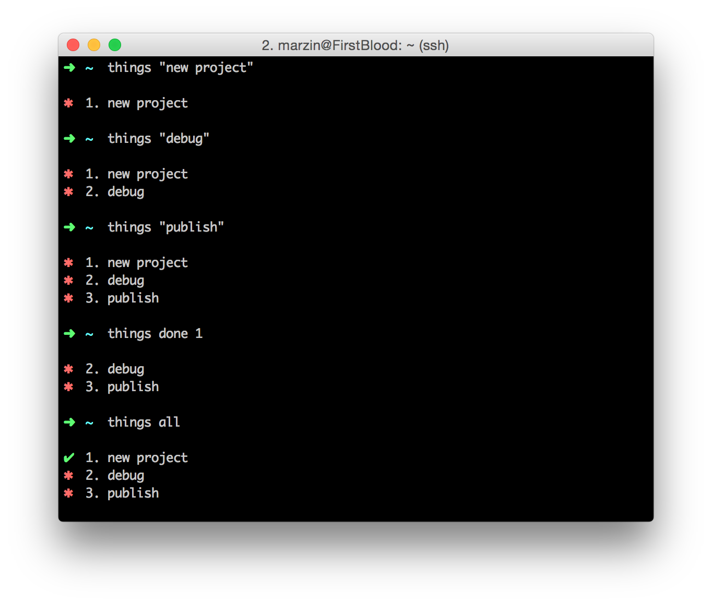

## A Easy To-do-list in Terminal


### Install

Cloning the repository and installing required Python library package

```bash
git clone https://github.com/MarzinZ/things.git
cd things
pip install -r requirements.txt
chomd +x things.py
```

Setting up an alias to run things.py

```bash
alias things=~/your/path/things.py
```

### Using

```
Usage:
     things.py                  shows to-do-list
     things.py all              shows to-do-list including things already done
     things.py clear            clear to-do-list
     things.py <thing>          add new thing to do
     things.py done <num>       mark the thing of index num having done
     things.py undo <num>       mark the thing of index num having not done
     things.py rm <num>         remove the thing of index num
```

### Example:


